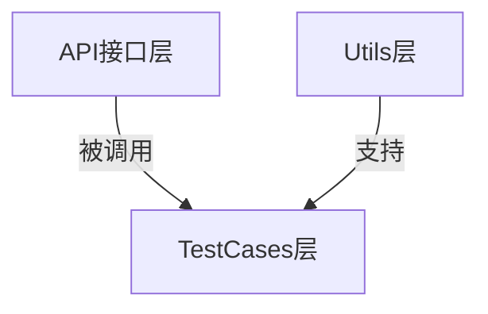

## 项目简介

本项目是一个开源的基于 **Python** 和 **requests** 封装的API自动化测试框架Demo，具有以下特点：

✅ **兼容性强**：<span style="background:#ffeb3b;padding:2px 5px;border-radius:3px">基于Python 3.8编写，最低兼容Python 3.8</span>  
✅ **规范注释**：所有类和方法均使用PEP 257规范及Google风格，添加了注释，以便于理解各个类和方法的调用及执行逻辑  
✅ **开源协议**：遵循MIT协议([查看详情](LICENSE))

### 注释示例

```python
class TokenManager:
    """
    数据库管理工具类

    提供添加和获取各个用户token的工具方法
    """
    # 初始化user_token作为存放各个账号token的字典
    user_token = {}

    # 日志器
    logger = get_logger(
        log_name="TokenManager",  # 使用类名作为日志器名称
        filename='./log/api-automated-testing.log',  # 所有类使用相同的日志文件
        level="INFO"  # 设置适当的日志级别
    )

    @classmethod
    def add_token_to_dict(cls, username: str, token: str) -> None:
        """
        添加token

        添加token的工具方法，往存放各个账号token的字典里添加一个元素：{ 账号，该账号的token值 }
        建议每次登录成功后都添加一个token，方便后续获取和使用

        Args:
            username: token所属的账号
            token: 该账号的token值
        """
        try:
            cls.user_token[username] = token
        except Exception as e:
            cls.logger.error(f"添加token异常: {e}")
            raise

    @classmethod
    def get_token_from_dict(cls, username: str) -> Dict[str, str]:
        """
        获取token

        获取token的工具方法，根据传入的账号username，从存放各个账号token的字典里获取此账号的token值
        在发起需要token鉴权的接口请求前，可根据该接口的业务场景，选择需要添加的账号的token作为请求头
        （比如需要管理员权限，就传入一个管理员账号，获取该账号的token。前提是该管理员账号已调用过登录接口并添加到了存放token的HashMap集合中）

        Args:
            username: token所属的账号

        Returns:
            Dict[str, str]: 存放该账号token的字典
        """
        try:
            return {"auth": cls.user_token[username]}
        except KeyError:
            cls.logger.error(f"找不到用户 '{username}' 的token")
            raise
        except Exception as e:
            cls.logger.error(f"获取token异常: {e}")
            raise
```

## 项目结构

```bash
api-automated-testing/
├── docs/    
│   ├── image/    # README文档引用图片目录
├── src/    # 项目源码目录
│   ├── config/    # 项目配置
│   │   ├── __init__.py
│   │   └── logging_config.py    # 日志配置
│   └── api-automated-testing/    # 测试框架封装
│       ├── __init__.py
│       ├── api/    # 接口请求层，封装接口请求
│       │   ├── __init__.py
│       │   ├── check_username_api.py
│       │   ├── login_api.py
│       │   └── register_api.py
│       ├── utils/    # 页面操作类
│       │   ├── __init__.py
│       │   ├── db_utils.py
│       │   ├── excel_erader.py
│       │   └── token_manager.py
├── tests/    # 测试代码目录
│   ├── data/    # 测试数据
│   │   └── test_data.xlsx
│   ├── resources/    # 测试资源
│   │   └── api-test-demo.jar
│   └── test_case/    # 测试用例
│       ├── __init__.py
│       ├── test_login.py
│       └── test_user.py
├── log/    # 日志目录
│   └── .gitkeep
├── .gitignore
├── .env.template    # 系统配置模板文件（存放基准路径以及数据库连接信息）
├── config.py    # 配置读取（读取配置文件里的基准路径等信息）
├── LICENSE    # 许可证条款
├── pyproject.toml    # 项目配置(依赖)管理
├── pytest.ini    # pytest配置文件
└── run_test.py    # 运行入口
```

## 

## 技术栈

| 作用            | Python               |
| ------------- | -------------------- |
| **测试报告**      | allure-pytest        |
| **API测试框架**   | requests             |
| **单元测试框架**    | pytest               |
| **控制用例执行顺序**  | pytest-order         |
| **失败重试**      | pytest-rerunfailures |
| **Excel数据处理** | openpyxl             |
| **日志框架**      | logging              |
| **数据库连接**     | pymysql              |

## 

## 🚀 快速启动指南

### 调试接口说明

项目包含本地可部署的接口Demo（约3MB），包含3个简单接口：

## API 文档

> 1、需要注意 使用http协议而不是https协议
> 
> 2、服务将在端口号4567上运行
> 
> 3、基准路径： `http://localhost:4567` 

### 1. 注册接口

- **URL**: `/register`

- **方法**: `POST`

- **参数**:
  
  - `username` (字符串): 用户名
  
  - `password` (字符串): 密码
  
  - `confirm_password` (字符串): 确认密码

- **成功响应**:
  
  ```json
  {"code": 200, "message": "注册成功"}
  ```

- **失败响应**:
  
  ```json
  {"code": 400, "message": "注册失败，密码不一致或用户名已存在"}
  ```

### 2. 登录接口

- **URL**: `/login`

- **方法**: `POST`

- **参数**:
  
  - `username` (字符串): 用户名
  
  - `password` (字符串): 密码

- **成功响应**:

```json
{"code": 200, "message": "登录成功", "data": "生成的token"}    
```

- **失败响应**:
  
  ```json
  {"code": 400, "message": "登录失败，用户名或密码错误"}
  ```

### 3. 查看当前账号接口

- **URL**: `/check-username`

- **方法**: `GET`

- **请求头**:
  
  - `auth`: 登录成功后返回的 token

- **成功响应**: 用户名 (字符串)

- **失败响应**: "用户未登录" (字符串)
  
  

> 📍 **Demo位置**：`tests/resources/api-test-demo.jar`  
> 

#### 特点：

- ✅ **一键部署**：`java -jar` 即可运行（无需Tomcat/数据库）

- ⚠️ **数据临时性**：每次运行清空上次数据（需重新注册）

> **声明**：
> 
> - 此Demo为开源项目，无任何有害行为，Demo源码Github仓库：[Github: api-demo](https://github.com/StephenLeungs/api-demo)
> 
> - 可以直接使用resources目录下附带的jar包，也可以从仓库拉取或下载Demo源码，通过Maven打包获得jar包后参考下方启动方式部署

### 部署步骤

1. **打开Pycharm，安装项目所需依赖：**

```bash
# 在Pycharm终端中执行此指令，自动安装项目所需依赖（需要配置好pip）
pip install .
```

2. **启动Web Demo**

```bash
# 进入jar包目录
cd tests/resources/

# 在目录下打开CMD，执行以下指令启动服务
java -jar api-test-demo.jar
```

3. **运行测试**

```bash
# 如果你的设备上安装并配置了allure环境，
# 直接通过以下指令执行测试并生成allure测试报告
python run_test.py


# 如果没有配置allure环境，
# 请先修改项目根目录下的pytest.ini配置文件后，执行以下指令运行测试
pytest
```

## 

## 🧱 框架封装解析

### **封装结构**



相对于WebUI自动化测试框架而言，结构更简单，只有三层 

### 1. 核心组件

#### **api包**（接口请求层）

按照一个接口请求一个类的原则，封装requests库提供的API，构造请求：

```python
class CheckUsernameAPI:
    """
    查询当前账号接口类

    封装查询当前账号接口
    """

    def __init__(self) -> None:
        """
        构造函数

        实例化时自动完成读取config配置文件里的基准路径并拼接查询当前账号接口url的操作
        """
        self.check_username_url = config.BASE_URL + '/check-username'

    def check_username(self, headers: Dict[str, str]) -> Response:
        """
        查询当前账号接口请求

        封装requests库get()方法，构造查询当前账号接口的请求

        Args:
            headers: 要查询的账号的token

        Returns:
            Response: 查询当前账号接口的响应
        """
        return requests.get(self.check_username_url, headers=headers)
```

#### **utils包**（工具层）

封装数据库管理、读取Excel文件测试数据等工具类：

```python
class TokenManager:
    """
    数据库管理工具类

    提供添加和获取各个用户token的工具方法
    """
    # 初始化user_token作为存放各个账号token的字典
    user_token = {}

    # 日志器
    logger = get_logger(
        log_name="TokenManager",  # 使用类名作为日志器名称
        filename='./log/api-automated-testing.log',  # 所有类使用相同的日志文件
        level="INFO"  # 设置适当的日志级别
    )

    @classmethod
    def add_token_to_dict(cls, username: str, token: str) -> None:
        """
        添加token

        添加token的工具方法，往存放各个账号token的字典里添加一个元素：{ 账号，该账号的token值 }
        建议每次登录成功后都添加一个token，方便后续获取和使用

        Args:
            username: token所属的账号
            token: 该账号的token值
        """
        try:
            cls.user_token[username] = token
        except Exception as e:
            cls.logger.error(f"添加token异常: {e}")
            raise

    @classmethod
    def get_token_from_dict(cls, username: str) -> Dict[str, str]:
        """
        获取token

        获取token的工具方法，根据传入的账号username，从存放各个账号token的字典里获取此账号的token值
        在发起需要token鉴权的接口请求前，可根据该接口的业务场景，选择需要添加的账号的token作为请求头
        （比如需要管理员权限，就传入一个管理员账号，获取该账号的token。前提是该管理员账号已调用过登录接口并添加到了存放token的HashMap集合中）

        Args:
            username: token所属的账号

        Returns:
            Dict[str, str]: 存放该账号token的字典
        """
        try:
            return {"auth": cls.user_token[username]}
        except KeyError:
            cls.logger.error(f"找不到用户 '{username}' 的token")
            raise
        except Exception as e:
            cls.logger.error(f"获取token异常: {e}")
            raise
```

> **注意**：如果需要调用db_utils工具类连接数据库，需要在项目根目录下的配置信息模板文件.env.template里填入自己的数据库连接信息，并把文件重命名为.env

```properties
# 环境配置文件模板
# 请复制此文件为 .env 并填写实际值

# 应用基准URL
BASE_URL=your_base_url_here

# 数据库连接配置
DB_HOST=your_database_host
DB_PORT=your_database_port
DB_NAME=your_database_name
DB_USER=your_database_username
DB_PASSWORD=your_database_password
DB_CHARSET=utf8mb4
```

#### **testcases包**（业务层）

调用api包里构造的请求，@pytest.mark.parametrize装饰器参数化测试：

```python
class TestUser:
    """
    用户模块测试类

    应包含所有用户模块的测试用例
    """
    # 日志器
    logger = get_logger(
        log_name="TestUser",  # 使用类名作为日志器名称
        filename='./log/api-automated-testing.log',  # 所有类使用相同的日志文件
        level="INFO"  # 设置适当的日志级别
    )

    reader = ExcelReader()
    check_username_test_data = reader.get_sheet_data_as_dict("CheckUsernameData")

    def setup_class(self) -> None:
        """
        setup_class特殊方法

        当前测试类执行前会执行一次，用于实例化查询当前账号接口类对象
        """
        self.check_username_api = CheckUsernameAPI()


    @pytest.mark.order(3)
    @pytest.mark.parametrize("check_username_data", check_username_test_data)
    def test_check_username(self, check_username_data: Dict[str, str]) -> None:
        """
        查询当前账号接口测试用例

        用于测试查询当前账号接口

        Args:
            check_username_data: 通过@pytest.mark.parametrize装饰器参数化，读取Excel文件获得的存放查询当前账号接口测试数据的字典
        """
        try:
            username = check_username_data["username"]
            headers = TokenManager.get_token_from_dict(username)
            assert check_username_data["expectedResult"] in self.check_username_api.check_username(headers=headers).text

        except Exception as e:
            self.logger.error(f"查询账号测试用例异常: {e}")
            raise
```

## 

## 🛠️ 辅助文件说明

| 文件               | 作用                            |
| ---------------- | ----------------------------- |
| `pyproject.toml` | 项目依赖管理                        |
| `pytest.ini`     | pytest配置文件                    |
| `config.py`      | 配置读取                          |
| `run_test.py`    | 封装集成了pytest测试和生成allure测试报告的过程 |